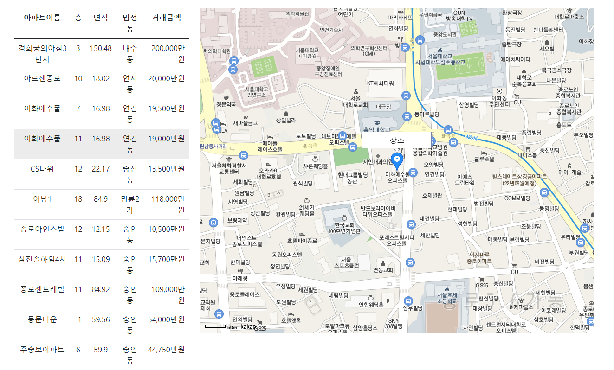

> <h1>과제 제목  - 구해줘 홈즈</h1>

> <h2>목표</h2>

- Web Front-End 기술인 HTML / CSS / JavaScript 를 이해하고 활용할 수 있다.
- Bootstrap 등 Library 를 활용해, 더욱 향상된 디자인 및 기능을 구현한다.
- 이미지, Map, Form 등을 활용해, 사용자의 입장에서 편리하고, 멋진 디자인을 설계해
  본다.

> <h2>Technology</h2>

- 기능
  - Bootstrap 템플릿 활용 HTML 작성
  - javascript 활용 로그인 기능 구현(회원가입, 로그아웃, 비밀번호 찾기 등)
  - AJAX 활용 아파트 매매 공공데이터 입력받은 후 관리
  - 동별, 아파트 별 실거래가 검색 결과 출력
  - Kakao Map Api 활용 검색결과 지도 화면 구성

> <h2>기본 기능</h2>

<h3>로그인</h3>
<br>
<b>기능 설명 </b>

<p>정상적으로 WhereIsMyHome 웹에 접속한 사용자는 본인이 회원 가입시 기재한 회원 정보
를 확인, 수정, 삭제(탈퇴) 버튼이 포함된 화면을 구현한다.

o 필수 요소

1. 회원 가입 페이지
2. 회원 정보 조회
3. 회원 정보 삭제(탈퇴)
4. 로그인/ 로그아웃 기능
5. 비밀번호 찾기 기능</p>

<b>구현 방법 </b>

<p>1. login.html , Signup.html에 회원가입 및 로그인 화면 구성</p>
<p>2. 로그인 정보 localStorage에 저장하여 데이터 관리 및 로그인 유무 확인</p>
<p>3. 비밀번호 찾기 시 아이디 "ssafy" 입력 시 비밀번호 값 출력</p>
<p>4. 로그인 성공 시 페이지 헤더 login, Signup 삭제 후 Logout, Profile 추가</p>
<p>5. Logout기능, Profile.html에 회원정보 열람 화면 구성</p>

| 번호 | File         | 구현 내용                                                         |     |
| ---- | ------------ | ----------------------------------------------------------------- | --- |
| 01   | login.html   | input, label태그 사용하여 데이터 입력, 데이터 일치 시 로그인 성공 |     |
| 02   | Signup.html  | 데이터 입력 후 회원가입 버튼 활용 회원가입 실시                   |     |
| 03   | login.js     | localStorage활용, style=display 속성 활용 헤더 수정               |     |
| 04   | Profile.html | 회원정보 출력                                                     |     |

<01> login.html

```html
<!-- Page content-->
<section class="py-5">
  <div class="container px-5">
    <!-- Contact form-->
    <div class="bg-light rounded-3 py-5 px-4 px-md-5 mb-5">
      <div class="text-center mb-5">
        <div class="feature bg-primary bg-gradient text-white rounded-3 mb-3">
          <i class="bi bi-envelope"></i>
        </div>
        <h1 class="fw-bolder">Go Login</h1>
        <p class="lead fw-normal text-muted mb-0">환영합니다.</p>
      </div>
      <div class="row gx-5 justify-content-center">
        <div class="col-lg-8 col-xl-6">
          <form id="contactForm" data-sb-form-api-token="API_TOKEN">
            <!-- ID input-->
            <div class="form-floating mb-3">
              <input
                class="form-control"
                id="textid"
                type="text"
                placeholder="Enter your text..."
              />
              <label for="text">ID</label>
              <div class="invalid-feedback">A ID is required.</div>
            </div>

            <!-- Password number input-->
            <div class="form-floating mb-3">
              <input class="form-control" id="Password" type="password" placeholder="*****" />
              <label for="password">Password</label>
              <div class="invalid-feedback">A Password is required.</div>
            </div>

            <!-- Submit success message-->
            <!---->
            <!-- This is what your users will see when the form-->
            <!-- has successfully submitted-->
            <div class="d-none" id="submitSuccessMessage">
              <div class="text-center mb-3">
                <div class="fw-bolder">Form submission successful!</div>
                To activate this form, sign up at
                <br />
              </div>
            </div>
            <!-- Submit error message-->
            <!---->
            <!-- This is what your users will see when there is-->
            <!-- an error submitting the form-->
            <div class="d-none" id="submitErrorMessage">
              <div class="text-center text-danger mb-3">Error sending message!</div>
            </div>
            <!-- Submit Button-->
            <div class="d-grid">
              <button class="btn btn-primary btn-lg" id="submitButton" type="submit">Submit</button>
              <br />
              <button class="btn btn-primary btn-lg" id="findpassword" type="submit">
                비밀번호 찾기
              </button>
            </div>
          </form>
        </div>
      </div>
    </div>
    <!-- Contact cards-->
  </div>
</section>
```

<02> Signup.html

```html
<!-- Page content-->
<section class="py-5">
  <div class="container px-5">
    <!-- Contact form-->
    <div class="bg-light rounded-3 py-5 px-4 px-md-5 mb-5">
      <div class="text-center mb-5">
        <div class="feature bg-primary bg-gradient text-white rounded-3 mb-3">
          <i class="bi bi-envelope"></i>
        </div>
        <h1 class="fw-bolder">회원가입</h1>
        <p class="lead fw-normal text-muted mb-0">환영합니다</p>
      </div>
      <div class="row gx-5 justify-content-center">
        <div class="col-lg-8 col-xl-6">
          <form id="contactForm" data-sb-form-api-token="API_TOKEN">
            <!-- Name input-->
            <div class="form-floating mb-3">
              <input
                class="form-control"
                id="name"
                type="text"
                placeholder="Enter your name..."
                data-sb-validations="required"
              />
              <label for="name">Full name</label>
              <div class="invalid-feedback" data-sb-feedback="name:required">
                A name is required.
              </div>
            </div>
            <!-- Name input-->
            <div class="form-floating mb-3">
              <input
                class="form-control"
                id="password"
                type="password"
                placeholder="Enter your password..."
                data-sb-validations="required"
              />
              <label for="password">Password</label>
              <div class="invalid-feedback" data-sb-feedback="name:required">
                A name is required.
              </div>
            </div>
            <!-- Email address input-->
            <div class="form-floating mb-3">
              <input
                class="form-control"
                id="email"
                type="email"
                placeholder="name@example.com"
                data-sb-validations="required,email"
              />
              <label for="email">Email address</label>
              <div class="invalid-feedback" data-sb-feedback="email:required">
                An email is required.
              </div>
              <div class="invalid-feedback" data-sb-feedback="email:email">Email is not valid.</div>
            </div>
            <!-- Phone number input-->
            <div class="form-floating mb-3">
              <input
                class="form-control"
                id="phone"
                type="tel"
                placeholder="(123) 456-7890"
                data-sb-validations="required"
              />
              <label for="phone">Phone number</label>
              <div class="invalid-feedback" data-sb-feedback="phone:required">
                A phone number is required.
              </div>
            </div>
            <!-- Message input-->
            <div class="form-floating mb-3">
              <textarea
                class="form-control"
                id="message"
                type="text"
                placeholder="Enter your message here..."
                style="height: 10rem"
                data-sb-validations="required"
              ></textarea>
              <label for="message">Message</label>
              <div class="invalid-feedback" data-sb-feedback="message:required">
                A message is required.
              </div>
            </div>
            <!-- Submit success message-->
            <!---->
            <!-- This is what your users will see when the form-->
            <!-- has successfully submitted-->
            <div class="d-none" id="submitSuccessMessage">
              <div class="text-center mb-3">
                <div class="fw-bolder">Form submission successful!</div>
                To activate this form, sign up at
                <br />
              </div>
            </div>
            <!-- Submit Button-->
            <div class="d-grid">
              <button class="btn btn-primary btn-lg" id="submitButton">회원가입</button>
            </div>
          </form>
        </div>
      </div>
    </div>
  </div>
</section>
```

<03> login.js

```js
document.getElementById("submitButton").onclick = login;

function login() {
  let textid = document.getElementById("textid").value;
  let userPw = document.getElementById("Password").value;
  console.log(textid);
  let data = {
    id: textid,
    pw: userPw,
  };
  localStorage.setItem("data", JSON.stringify(data));
  // 나를 열었던 사람한테
  self.close();
  // 비어있는 문자열, 숫자 0 false처리
  if (textid == "ssafy" && userPw == "1234") {
    alert("로그인 success");
    console.log("asdasdasd");
    console.log(document.querySelector("#Signup").getAttribute("style"));
    document.location.href = "index.html";
    console.log(document.querySelector("#Profile").getAttribute("style"));
  } else {
    alert("로그인 fail");
  }
}
let data = localStorage.getItem("data");
if (data) {
  // 로컬 스토리지에서 vote라는 이름의 값이 있을 경우
  data = JSON.parse(data);
  console.log(data);
  if (data) {
    document.querySelector("#Login").setAttribute("style", "display:none");
    document.querySelector("#Signup").setAttribute("style", "display:none");
    document.querySelector("#Profile").setAttribute("style", "display: block");
  } else {
    document.querySelector("#Login").setAttribute("style", "display:block");
    document.querySelector("#Signup").setAttribute("style", "display:block");
    document.querySelector("#Profile").setAttribute("style", "display: none");
  }
}
```

<04> Profile.html

```html
<!-- Page content-->
<section class="py-5">
  <div class="container px-5">
    <!-- Contact form-->
    <div class="bg-light rounded-3 py-5 px-4 px-md-5 mb-5">
      <div class="text-center mb-5">
        <div class="feature bg-primary bg-gradient text-white rounded-3 mb-3">
          <i class="bi bi-envelope"></i>
        </div>
        <h1 class="fw-bolder">회원정보확인</h1>
        <p class="lead fw-normal text-muted mb-0">환영합니다</p>
      </div>
      <div class="row gx-5 justify-content-center">
        <div class="col-lg-8 col-xl-6">
          <form id="contactForm" data-sb-form-api-token="API_TOKEN">
            <!-- Name input-->
            <div class="form-floating mb-3">
              <input
                class="form-control"
                id="name"
                type="text"
                placeholder="Enter your name..."
                data-sb-validations="required"
                readonly
              />
              <label for="name">싸피싸피</label>
            </div>
            <!-- Name input-->
            <div class="form-floating mb-3">
              <input
                class="form-control"
                id="password"
                type="text"
                placeholder="Enter your password..."
                data-sb-validations="required"
                readonly
              />
              <label for="password">1234</label>
            </div>
            <!-- Email address input-->
            <div class="form-floating mb-3">
              <input
                class="form-control"
                id="email"
                type="email"
                placeholder="name@example.com"
                data-sb-validations="required,email"
                readonly
              />
              <label for="email">hellossafy@ssafy.com</label>
            </div>
            <!-- Phone number input-->
            <div class="form-floating mb-3">
              <input
                class="form-control"
                id="phone"
                type="tel"
                placeholder="(123) 456-7890"
                data-sb-validations="required"
                readonly
              />
              <label for="phone">010-8888-5555</label>
            </div>
            <!-- Message input-->
            <div class="form-floating mb-3">
              <textarea
                class="form-control"
                id="message"
                type="text"
                placeholder="Enter your message here..."
                style="height: 10rem"
                data-sb-validations="required"
                readonly
              ></textarea>
              <label for="message">즐거운 추석</label>
            </div>
            <!-- Submit Button-->
            <div class="d-grid">
              <button class="btn btn-primary btn-lg" id="submitButton">수정</button>
              <br />
              <button class="btn btn-primary btn-lg" id="submitButton">삭제</button>
            </div>
          </form>
        </div>
      </div>
    </div>
  </div>
</section>
```

<b>결과 화면</b>

<p>1. 로그인 화면</p>
</img>
<p>2. 프로필 화면</p>
</img>

> <h2>기본 기능</h2>

<h2>메인 페이지( 동별, 아파트별 실거래가 조회 기능 포함) - 동별 실거래가 조회 결과 페이지</h2>
<br>
<b>기능 설명 </b>
<p>아파트 매매 , 거래 내역 정보와 아파트 정보 파일의 공공데이터의 url을 읽어 고객이 원하는 주택 정보를 조회하고 그 결과를 화면에 표시했다. 검색은 시도 별,구군 별, 동별, 매매년도 선택과 매매월을 통해 분류했다.</p>
<b>구현 방법 </b>
<p>먼저  html로 시도선택, 구군선택, 동선택, 매매월선택을 select 박스로 가져와 준다. 그 후 아파트매매정보 가져오기 버튼을 통해 해당 내용을 가져왔다. </p>
<p>국토교통부_아파트매매 실거래자료의 공공데이터 정보가 있는 json 문서를 parsing하여 객체화 했고, 원하는 정보를 가져와 결과로 보여줬다.</p>

| 번호 | Package & Class | 구현 내용                                                        | 비고     |
| ---- | --------------- | ---------------------------------------------------------------- | -------- |
| 01   | index.html      | select 형태로 이뤄진 html                                        | 50 line  |
| 02   | index.html      | select box 설정 (지역, 매매기간)                                 | 95 line  |
| 03   | index.html      | 버튼으로 선택된 아파트 매매 정보를 왼쪽에 테이블 형태로 보여준다 | 219 line |

<01>

```html
<!-- 중앙 content start -->
<div class="container">
  <div style="height: 70px"></div>
  <h2 class="text-center mt-5 mb-3">아파트 매매 정보</h2>
  <div class="row col-md-12 justify-content-center mb-2">
    <div class="form-group col-md-2">
      <select class="form-select bg-secondary text-light" id="sido">
        <option value="">시도선택</option>
      </select>
    </div>
    <div class="form-group col-md-2">
      <select class="form-select bg-secondary text-light" id="gugun">
        <option value="">구군선택</option>
      </select>
    </div>
    <div class="form-group col-md-2">
      <select class="form-select bg-secondary text-light" id="dong">
        <option value="">동선택</option>
      </select>
    </div>
    <div class="form-group col-md-2">
      <select class="form-select bg-dark text-light" id="year"></select>
    </div>
    <div class="form-group col-md-2">
      <select class="form-select bg-dark text-light" id="month">
        <option value="">매매월선택</option>
      </select>
    </div>
    <div class="form-group col-md-2">
      <button type="button" id="list-btn" class="btn btn-outline-primary">
        아파트매매정보가져오기
      </button>
    </div>
  </div>
</div>
```

<02>

```js
///////////////////////// select box 설정 (지역, 매매기간) /////////////////////////
let date = new Date();

window.onload = function () {
  let yearEl = document.querySelector("#year");
  let yearOpt = `<option value="">매매년도선택</option>`;
  let year = date.getFullYear();
  for (let i = year; i > year - 20; i--) {
    yearOpt += `<option value="${i}">${i}년</option>`;
  }
  yearEl.innerHTML = yearOpt;

  // 브라우저가 열리면 시도정보 얻기.
  sendRequest("sido", "*00000000");
};

document.querySelector("#year").addEventListener("change", function () {
  let month = date.getMonth() + 1;
  let monthEl = document.querySelector("#month");
  let monthOpt = `<option value="">매매월선택</option>`;
  let yearSel = document.querySelector("#year");
  let m = yearSel[yearSel.selectedIndex].value == date.getFullYear() ? month : 13;
  for (let i = 1; i < m; i++) {
    monthOpt += `<option value="${i < 10 ? "0" + i : i}">${i}월</option>`;
  }
  monthEl.innerHTML = monthOpt;
});

// 시도가 바뀌면 구군정보 얻기.
document.querySelector("#sido").addEventListener("change", function () {
  if (this[this.selectedIndex].value) {
    let regcode = this[this.selectedIndex].value.substr(0, 2) + "*00000";
    sendRequest("gugun", regcode);
  } else {
    initOption("gugun");
    initOption("dong");
  }
});

// 구군이 바뀌면 동정보 얻기.
document.querySelector("#gugun").addEventListener("change", function () {
  if (this[this.selectedIndex].value) {
    let regcode = this[this.selectedIndex].value.substr(0, 5) + "*";
    sendRequest("dong", regcode);
  } else {
    initOption("dong");
  }
});

function sendRequest(selid, regcode) {
  const url = "";
  let params = "regcode_pattern=" + regcode + "&is_ignore_zero=true";
  fetch(`${url}?${params}`)
    .then((response) => response.json())
    .then((data) => addOption(selid, data));
}

function addOption(selid, data) {
  let opt = ``;
  initOption(selid);
  switch (selid) {
    case "sido":
      opt += `<option value="">시도선택</option>`;
      data.regcodes.forEach(function (regcode) {
        opt += `
                <option value="${regcode.code}">${regcode.name}</option>
                `;
      });
      break;
    case "gugun":
      opt += `<option value="">구군선택</option>`;
      for (let i = 0; i < data.regcodes.length; i++) {
        if (i != data.regcodes.length - 1) {
          if (
            data.regcodes[i].name.split(" ")[1] == data.regcodes[i + 1].name.split(" ")[1] &&
            data.regcodes[i].name.split(" ").length != data.regcodes[i + 1].name.split(" ").length
          ) {
            data.regcodes.splice(i, 1);
            i--;
          }
        }
      }
      let name = "";
      data.regcodes.forEach(function (regcode) {
        if (regcode.name.split(" ").length == 2) name = regcode.name.split(" ")[1];
        else name = regcode.name.split(" ")[1] + " " + regcode.name.split(" ")[2];
        opt += `
                <option value="${regcode.code}">${name}</option>
                `;
      });
      break;
    case "dong":
      opt += `<option value="">동선택</option>`;
      let idx = 2;
      data.regcodes.forEach(function (regcode) {
        if (regcode.name.split(" ").length != 3) idx = 3;
        opt += `
                <option value="${regcode.code}">${regcode.name.split(" ")[idx]}</option>
                `;
      });
  }
  document.querySelector(`#${selid}`).innerHTML = opt;
}

function initOption(selid) {
  let options = document.querySelector(`#${selid}`);
  options.length = 0;
  let len = options.length;
  for (let i = len - 1; i >= 0; i--) {
    options.remove(i);
  }
}
```

<03>

```javascript
///////////////////////// 아파트 매매 정보 /////////////////////////
document.querySelector("#list-btn").addEventListener("click", function () {
let address_header_map ="";
var selectoption1 = document.getElementById("sido");
var selectoption2 = document.getElementById("gugun");
var selectoption3 = document.getElementById("dong");
address_header_map = selectoption1[selectoption1.selectedIndex].text + " "
+selectoption2[selectoption2.selectedIndex].text+ " " +selectoption3[selectoption3.selectedIndex].text;


let url =
    "";
let gugunSel = document.querySelector("#gugun");
let regCode = gugunSel[gugunSel.selectedIndex].value.substr(0, 5);
let yearSel = document.querySelector("#year");
let year = yearSel[yearSel.selectedIndex].value;
let monthSel = document.querySelector("#month");
let month = monthSel[monthSel.selectedIndex].value;
let dealYM = year + month;
let queryParams =
    encodeURIComponent("serviceKey") +
    "=" +
    ""; /*Service Key*/
queryParams +=
    "&" +
    encodeURIComponent("LAWD_CD") +
    "=" +
    encodeURIComponent(regCode); /*아파트소재 구군*/
queryParams +=
    "&" +
    encodeURIComponent("DEAL_YMD") +
    "=" +
    encodeURIComponent(dealYM); /*조회년월*/
queryParams +=
    "&" +
    encodeURIComponent("pageNo") +
    "=" +
    encodeURIComponent("1"); /*페이지번호*/
queryParams +=
    "&" +
    encodeURIComponent("numOfRows") +
    "=" +
    encodeURIComponent("30"); /*페이지당건수*/


function makeList(data) {
document.querySelector("table").setAttribute("style", "display: ;");
let tbody = document.querySelector("#aptlist");
let parser = new DOMParser();
const xml = parser.parseFromString(data, "application/xml");
// console.log(xml);
initTable();
let apts = xml.querySelectorAll("item");
let cnt = 0;
apts.forEach((apt) => {
    console.log(apt);
    // console.log(apt.querySelector("법정동").textContent);
    // console.log(apt.querySelector("아파트").textContent);
    let tr = document.createElement("tr");
    tr.setAttribute("id","trname" + cnt);
    let nameTd = document.createElement("td");
    nameTd.setAttribute("id","aptname");
    nameTd.appendChild(
    document.createTextNode(apt.querySelector("아파트").textContent)
    );
    tr.appendChild(nameTd);

    let floorTd = document.createElement("td");
    floorTd.appendChild(
    document.createTextNode(apt.querySelector("층").textContent)
    );
    tr.appendChild(floorTd);

    let areaTd = document.createElement("td");
    areaTd.appendChild(
    document.createTextNode(apt.querySelector("전용면적").textContent)
    );
    tr.appendChild(areaTd);

    let dongTd = document.createElement("td");
    dongTd.setAttribute("id","dongname");
    dongTd.appendChild(
    document.createTextNode(apt.querySelector("법정동").textContent)
    );
    tr.appendChild(dongTd);

    let priceTd = document.createElement("td");
    priceTd.appendChild(
    document.createTextNode(apt.querySelector("거래금액").textContent + "만원")
    );
    priceTd.classList.add("text-end");
    tr.appendChild(priceTd);

    tbody.appendChild(tr);
    let arr = "trname"+cnt;
    let dongarr = apt.querySelector("도로명").textContent;
    let aptarr = apt.querySelector("도로명건물본번호코드").textContent;

    document.getElementById(arr).addEventListener("click",()=>trclick(dongarr,aptarr));

    cnt++;
});
}

function initTable() {
let tbody = document.querySelector("#aptlist");
let len = tbody.rows.length;
for (let i = len - 1; i >= 0; i--) {
    tbody.deleteRow(i);
}
}

```

<b>결과 </b>

<p>원하는 동에 대해 조회하여 상세 정보를 확인할 수 있다.</p>

<br>

- 기본 화면 구성
  </img>

  </img>
  <br>
  </img>
  <br>

<br>
<br>
<br>

<h2> 메인 페이지 - 동별 실거래가 조회 결과 페이지</h2>

<br>

<b>기능 설명 </b>

<p>조회된 동에 해당되는 지역을 맵으로 보여준다. </p>
<b>구현 방법 </b>

| 번호 | Package & Class | 구현 내용 | 비고 |
| ---- | --------------- | --------- | ---- |

| 01 | index.html | 해당 동의 맵을 보여준다. 시도와 구군과 동을 통해 주소를 만들어주고 주소에 해당하는 맵을 보여주도록했다. | 264- |

<01>

```javascript

 let address_header_map ="";
var selectoption1 = document.getElementById("sido");
var selectoption2 = document.getElementById("gugun");
var selectoption3 = document.getElementById("dong");
address_header_map = selectoption1[selectoption1.selectedIndex].text + " "
+selectoption2[selectoption2.selectedIndex].text+ " " +selectoption3[selectoption3.selectedIndex].text;

var myLatLng = new kakao.maps.LatLng(33.450701, 126.570667);
var container = document.getElementById("map"); //지도를 담을 영역의 DOM 레퍼런스
var options = {
//지도를 생성할 때 필요한 기본 옵션
center: myLatLng, //지도의 중심좌표.
level: 3, //지도의 레벨(확대, 축소 정도)
};

var map = new kakao.maps.Map(container, options); //지도 생성 및 객체 리턴

// 주소-좌표 변환 객체를 생성합니다
var geocoder = new kakao.maps.services.Geocoder();

geocoder.addressSearch(address_header_map, function(result, status) {

    // 정상적으로 검색이 완료됐으면
    if (status === kakao.maps.services.Status.OK) {

        var coords = new kakao.maps.LatLng(result[0].y, result[0].x);

        var resultDiv = document.getElementById('clickLatlng');

        // 결과값으로 받은 위치를 마커로 표시합니다
        var marker = new kakao.maps.Marker({
            map: map,
            position: coords
        });

        // 인포윈도우로 장소에 대한 설명을 표시합니다
        var infowindow = new kakao.maps.InfoWindow({
            content: '<div style="width:150px;text-align:center;padding:6px 0;">장소</div>'
        });
        infowindow.open(map, marker);

        // 지도의 중심을 결과값으로 받은 위치로 이동시킵니다
        map.setCenter(coords);
    }
});


fetch(`${url}?${queryParams}`)
.then((response) => response.text())
.then((data) => makeList(data));


});
```

<b>결과 </b>

- 사진 변경 구성

  </img>

---

<h2>메인 페이지 - 아파트별 실거래가 조회 결과 페이지</h2>
<b>기능 설명 </b>
<p>조회된 동에 해당하는 상세정보로 아파들들이 나온다. 아파트의 상세정보를 볼 수 있고 원하는 아파트를 클릭하면 지도에 아파트에 해당하는 위치로 바뀌도록 만들었다.</p>
<b>구현 방법 </b>
<br>

| 번호 | Package & Class | 구현 내용                                                                                | 비고               |
| ---- | --------------- | ---------------------------------------------------------------------------------------- | ------------------ |
| 01   | index.html      | 아파트의 이름, 층, 면적, 법정동과 거래금액이 나오도록 만들었다.                          | 396line            |
| 02   | index.html      | makeList 함수에 도로명과 도로명건물 번호 코드를받아 tr이 클릭되면 지도로 보여주도록했다. | 364 line, 517 line |

<01>

```javascript
<table class="table table-hover text-center" style="display: none">
  <tr>
    <th>아파트이름</th>
    <th>층</th>
    <th>면적</th>
    <th>법정동</th>
    <th>거래금액</th>
  </tr>
  <tbody id="aptlist"></tbody>
</table>
```

```javascript
let dongarr = apt.querySelector("도로명").textContent;
let aptarr = apt.querySelector("도로명건물본번호코드").textContent;

document.getElementById(arr).addEventListener("click", () => trclick(dongarr, aptarr));
```

<02>

```javascript
function trclick(dongarr, aptarr) {
  // 지도 스크립트
  // console.log(dongarr+" "+aptarr);
  let address_header_map = dongarr + " " + aptarr;
  console.log(address_header_map);
  var myLatLng = new kakao.maps.LatLng(33.450701, 126.570667);
  var container = document.getElementById("map"); //지도를 담을 영역의 DOM 레퍼런스
  var options = {
    //지도를 생성할 때 필요한 기본 옵션
    center: myLatLng, //지도의 중심좌표.
    level: 3, //지도의 레벨(확대, 축소 정도)
  };

  var map = new kakao.maps.Map(container, options); //지도 생성 및 객체 리턴

  // 주소-좌표 변환 객체를 생성합니다
  var geocoder = new kakao.maps.services.Geocoder();

  geocoder.addressSearch(address_header_map, function (result, status) {
    // 정상적으로 검색이 완료됐으면
    if (status === kakao.maps.services.Status.OK) {
      var coords = new kakao.maps.LatLng(result[0].y, result[0].x);
      // var message = 'latlng: new kakao.maps.LatLng(' + result[0].y + ', ';
      // message += result[0].x + ')';

      var resultDiv = document.getElementById("clickLatlng");
      // resultDiv.innerHTML = message;

      // 결과값으로 받은 위치를 마커로 표시합니다
      var marker = new kakao.maps.Marker({
        map: map,
        position: coords,
      });

      // 인포윈도우로 장소에 대한 설명을 표시합니다
      var infowindow = new kakao.maps.InfoWindow({
        content: '<div style="width:150px;text-align:center;padding:6px 0;">장소</div>',
      });
      infowindow.open(map, marker);

      // 지도의 중심을 결과값으로 받은 위치로 이동시킵니다
      map.setCenter(coords);
    }
  });
}
```

<br>

- 화면 구성
  <br>
  </img>
  <br>

  </img>
  <br>

<br>
<br>
